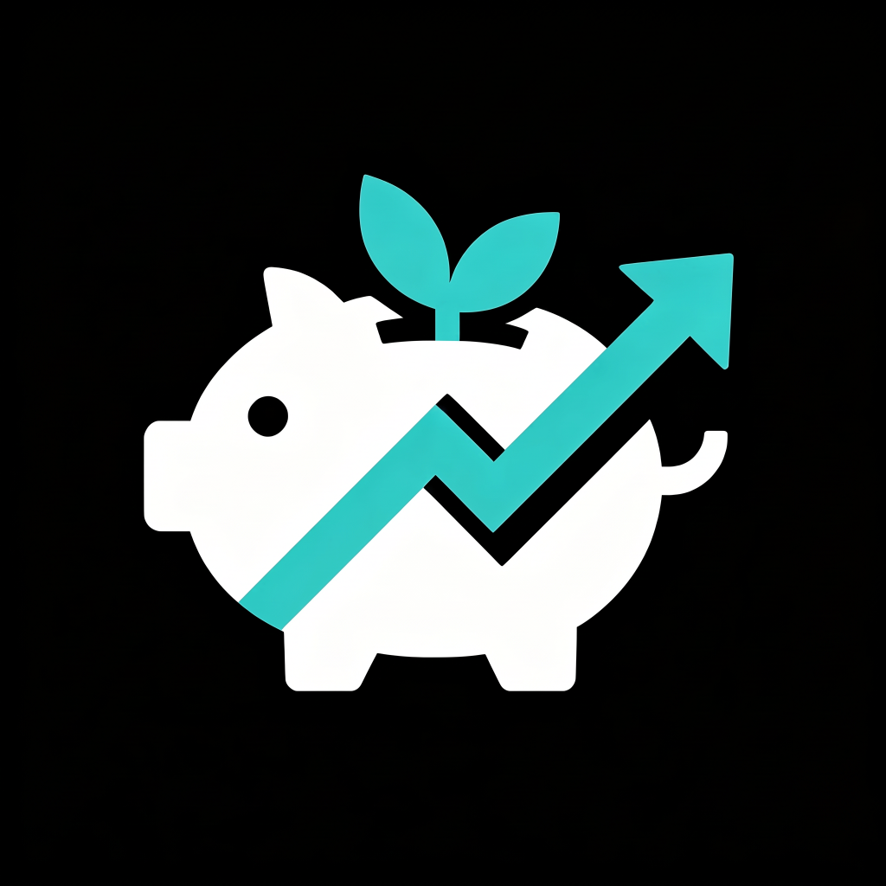

# 资产管理（iAssets）

<p align="center">
  
</p>

一款使用 Flutter 开发的个人资产管理 iOS APP，包含“股票”和“资产”双页面，支持实时行情、多币种换算、盈亏统计、派息记录、收益曲线、iCloud 同步、**多类型资产管理**等功能，采用 Material 3 暗色主题设计。

已在[App Store](https://apps.apple.com/cn/app/iassets/id6790114856) 上线，欢迎支持和使用。 无内购无广告，使用公开 API，不保证严格实时。

## 功能特性

### 股票管理
- **持仓总览** — 展示总资产、持仓市值、持仓总成本、总盈亏、已实现盈亏、税后总股息、已平仓总额，并支持收益曲线查看
- **持仓列表** — 展示 Logo、公司名、代码、市值、持仓数量、盈亏；可展开查看总成本、均价、最大/最小购买价、买卖次数等详情
- **搜索与建仓** — 支持美股、港股、A 股搜索，支持按市场筛选结果；添加时自动创建首笔买入记录，并自动带入默认手续费
- **交易与派息** — 支持加仓、减仓、平仓、删除、派息；买卖记录和派息记录均可编辑、删除，修改后自动重算持仓
- **排序与刷新** — 支持按盈亏、持仓市值、代码排序；前台每 60 秒定时刷新，下拉可手动刷新
- **收益曲线** — 支持今天、7天、30天、180天、360天等粒度；前台刷新、切后台和后台任务都会记录收益快照，历史最多保留一年

### 资产管理
- **资产总览** — 总资产、股票市值、总成本、总盈亏（金额+百分比）、税后总股息、持仓比例一屏展示；总资产 = 股票市值 + 非股票资产折算值
- **多类型管理** — 支持**现金**、**活期存款**、**定期存款**、**理财/基金**、**公积金**五种资产类型统一管理
- **分组折叠** — 资产按分类分组展示，每个分类可独立折叠/展开，并保留折叠状态
- **拖拽排序** — 分类标题可拖拽调整顺序，同分类内资产可拖拽调整顺序；跨分类拖拽会被拦截并提示
- **计算方式** — 定期存款按本金、年利率、期限计算总值；理财/基金按持有份额和单位净值计算当前价值
- **公式说明** — 设置页提供"计算公式"对话框，各指标计算方式一目了然

### 设置
- **本地货币** — 支持 CNY / CNH / USD / HKD / EUR / JPY / GBP / AUD / CAD / CHF / KRW / SGD 切换，实时汇率自动换算，默认货币持久化
- **iCloud 同步** — 本地文件优先读写，开启后自动同步设置、股票、记录、资产和收益快照；切回前台会拉取最新数据
- **排序与偏好** — 支持默认排序字段、排序方向、平仓后保留持仓开关等偏好设置
- **手续费** — 支持默认手续费按比例或固定金额配置，建仓和加减仓时自动填入
- **其他** — 提供计算公式、意见反馈、开源软件说明、版本信息

## 技术栈

| 类别   | 技术                                    |
|------|---------------------------------------|
| 框架   | Flutter 3.44.4（CI） / Dart SDK ^3.12.2 |
| UI   | Material 3                            |
| 本地化  | flutter_localizations、intl            |
| 网络   | http                                  |
| 本地存储 | 文件系统（JSON）                            |
| 路径访问 | path_provider                         |
| 云同步  | iCloud（CloudKit / CloudDocuments）     |
| 后台任务 | workmanager                           |
| 版本信息 | package_info_plus                     |
| 系统调用 | url_launcher                          |
| 数据源  | 东方财富搜索、腾讯行情、东方财富行情补充、ExchangeRate-API |

## 快速开始

```bash
# 克隆
git clone https://github.com/bitlap/assets
cd assets

# 依赖环境
# - Flutter 3.44.4 stable
# - Xcode / CocoaPods
# - iOS 14.0+

# 配置 Apple Developer Team ID（用于真机调试和签名）
cp ios/Config.example.xcconfig ios/Config.xcconfig
# 编辑 ios/Config.xcconfig，填入你的 DEVELOPMENT_TEAM
#
# 如果你需要使用自己的签名 / 包名 / iCloud 配置，还要同步修改：
# - Bundle Identifier（当前默认 org.bitlap.assets）
# - iCloud Container / kvstore 标识（当前默认 iCloud.org.bitlap.assets）

# 安装依赖
flutter pub get

# 运行（iOS 模拟器）
open -a Simulator
flutter run

# 真机调试 / 签名检查
open ios/Runner.xcworkspace
flutter devices            # 查看设备 ID
flutter run -d <device_id>

# 代码分析
flutter analyze

# 单元测试
flutter test

# 格式化
dart format .
```

## 贡献

欢迎提交 Issue 和 Pull Request。

### 开发准则

- 保持 `flutter analyze --fatal-infos` 无错误
- 提交前运行 `dart format .`
- PR 标题用中文简述改动，描述中英文均可

### PR 流程

1. Fork 并创建特性分支
2. 确保 `flutter analyze` 通过
3. 提交 PR，描述改了什么和为什么
4. 维护者 review 后合并

## 配置

| 配置项       | 值                                               | 说明                         |
|-----------|-------------------------------------------------|----------------------------|
| 行情刷新间隔    | 60 秒                                            | 前台定时刷新行情                   |
| 首次刷新延迟    | 3 秒                                             | 启动后延迟刷新，避免冷启动阻塞            |
| 行情缓存      | 15 分钟                                           | 股票行情缓存有效期                  |
| 搜索缓存      | 5 分钟                                            | 搜索结果缓存有效期                  |
| 汇率缓存      | 24 小时                                           | 汇率缓存有效期                    |
| 搜索防抖      | 1000 ms                                         | 输入停止后延迟搜索                  |
| API 熔断    | 连续 3 次失败，冷却 5 分钟                                | 搜索、行情、汇率请求共用保护策略           |
| HTTP 超时   | 15 秒                                            | 单次请求超时上限                   |
| 后台快照间隔    | 10 分钟                                           | WorkManager 定时记录收益快照       |
| 支持币种      | CNY、CNH、USD、HKD、EUR、JPY、GBP、AUD、CAD、CHF、KRW、SGD | 当前代码实际支持                   |
| 数据源       | 东方财富搜索、腾讯行情、东方财富行情补充、ExchangeRate-API           | 当前代码实际使用                   |
| iOS 最低版本  | 14.0                                            | 当前 Xcode 工程配置              |
| Bundle ID | `org.bitlap.assets`                             | 当前工程默认值，克隆后可按需修改           |
| Team ID   | `ios/Config.xcconfig`                           | 通过 `DEVELOPMENT_TEAM` 配置签名 |
| iCloud 容器 | `iCloud.org.bitlap.assets`                      | 若修改包名需同步调整                 |
| 后台任务标识    | `profit-snapshot`                               | 已注册到 iOS BGTaskScheduler   |
